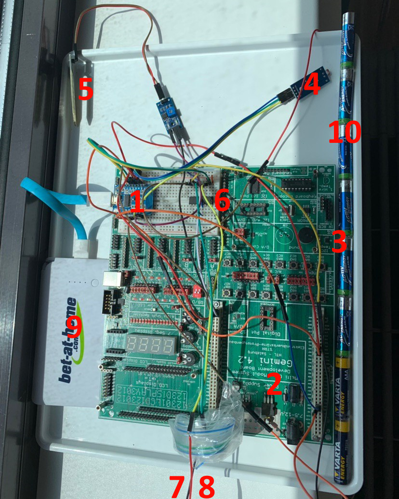

# Watering System
This document describes the hardware setup and the corresponding thought process behind it. It was developed mainly by Alex Stelzhammer and Lorenz Graf.

# Idea
The long term idea is that the sensor values (temperature, brightness, humidity) are used within an algorithm that calculates the optimal time for watering the plants. It then performs the watering autonomously using the integrated actuator components.

# Components
Here is a quick overview of the components that were implemented in the gardening system. You may use the numbers provided on the image to cross-reference the components.

## Base
 - Wemos D1 Mini (1)
 - Gemini Board (developed by Lorenz a few years ago) (2)

## Sensors
 - I²C Temperature Sensor (3)
 - Digital Brightness Sensor (Threshold based) (4)
 - Analog Ground Moisture Sensor (5)

## Actuators
 - Motor Driver (6)
 - Submersible Water Pump (7)
 - Water Hose (8)

## Power
 - 5V USB Battery Pack (9)
 - 12V Serial AAA Setup (10)

## Other
 - Buttons on the Gemini
 - LEDs on the Gemini

# Development Process
We worked the first few hours with an Arduino Uno with a WLAN enabling shield component. However the wireless lan module somehow messed up our analog measurements (maybe a timer problem during wifi communication?). Nevertheless we switched to a Wemos D1 Mini where our code worked flawlessly and the measurmenet problems were fixed. However through this we had a trade-off of having only a single analog input pin.

We worked around the analog pin problem pretty well though: we had a few seperate pcb modules that have A/D converters and potentiometers integrated. These then provide a digital output when a threshold is reached. The threshold can be modified via the potentiometer. So we still get **some** information from these sensors, but with way less accuracy.

We then found out that the temperature sensor we had didn't work, or was very inconsistent to say the least. Lorenz remembered having a PCB he developed years ago where we could seamlessly connect to the I²C bus and tap its temperature sensor. That is how the Gemini board came in to play in the first place (it got some more usage later on). We now had all the sensors and the MCU covered.

For the actual water pump (actuator) we required several components because the pump required at least 12V to function. Since we weren't prepared for this at all (we didn't buy the pump ourselves and couldn't set any requirements), plus at this time it was the weekend, we got a motor driver from Lorenz to control the different voltage levels. 

We now had only the power supply left to figure out. We knew we required 12V for the pump but didn't have anything that matched. To make sure though we soldered pins onto a slaughtered USB cable and attempted running the pump on 5V. This did not work. So we started gathering AAA batteries, which have 1.5V (so we need exactly 8). We got 4 from several remotes and found 4 kind-of fresh ones laying around. We then used tape to glue them together. Even though not very safe, this worked like a charm. (later we switched to a case which holds them more safely)

We then implemented some buttons for manual control of the water pump for testing as well as a panic button that would stop any pumping that was started through mqtt that might not have gone as planned. We also used a few LEDs as status LEDs to have some debug information of the system (button presses, pump state, ...).

For the final testing we connected the Wemos D1 Mini to a 5V battery pack so that the entire setup is socket independent. Testing was done by pumping water from one cup to another in different ways (mqtt, manual) through a short hose.

# Limitations
We found a few soft limitations that were somewhat to be expected but nevertheless very interesting:

 - The potential energy of the water played a big role in power consumption (long vertical pumping may be slower)
 - The batteries that were taped together did not have the best connectivity between them. That is why we switched to the fixed battery case later on.
 - 12V pumps don't work "slower" with less voltage, they can not even get the initial turn required for startup.
 - The Arduino Uno with the wireless lan shield caused problems (probably timer / interrupt / workload related) with analog measurements.
 - The entire software was coded as FSM which let us manage priorities and workloads on a very granular level.